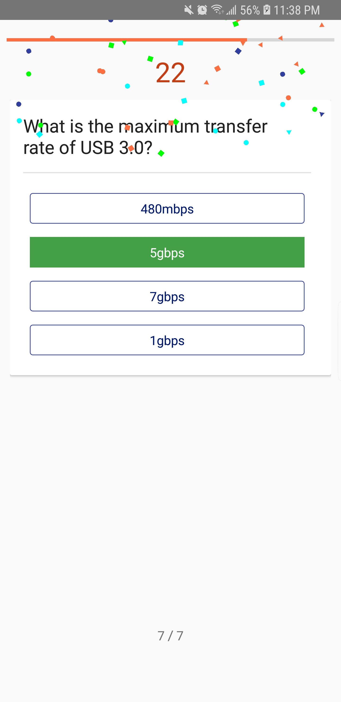
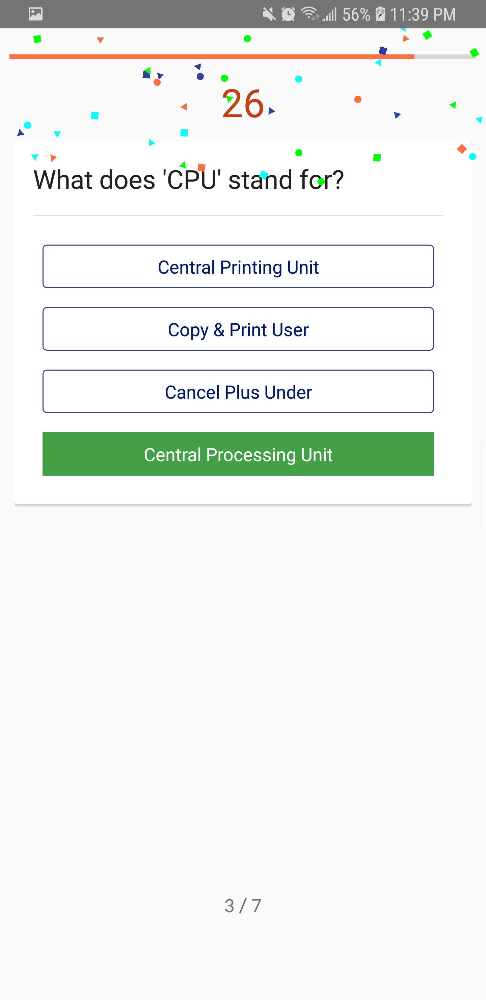
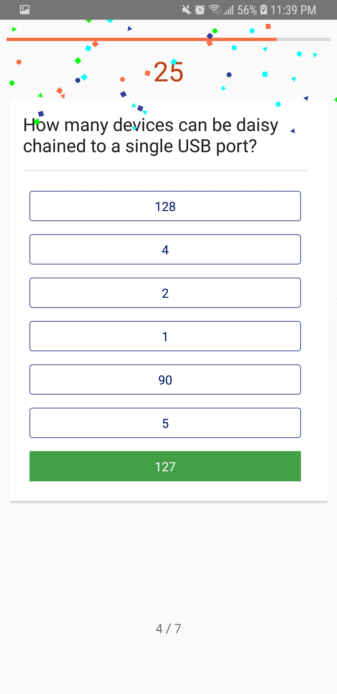
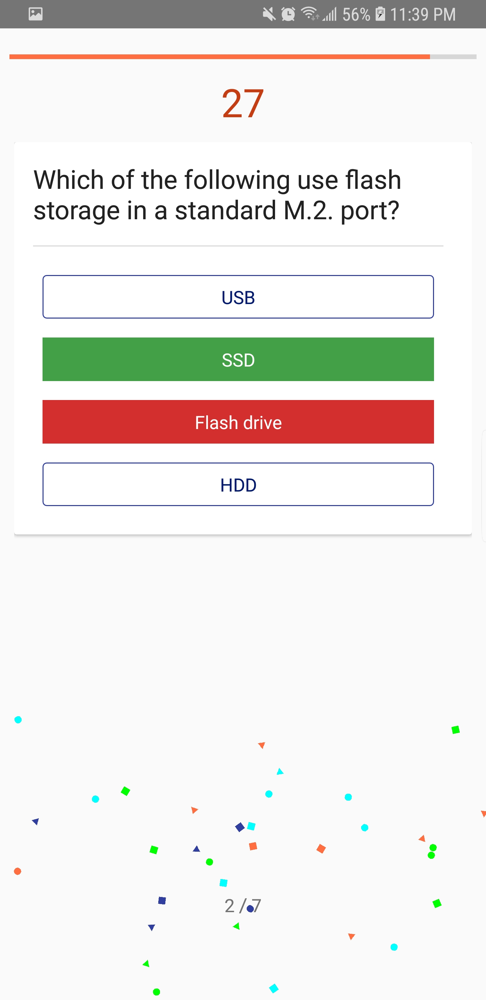
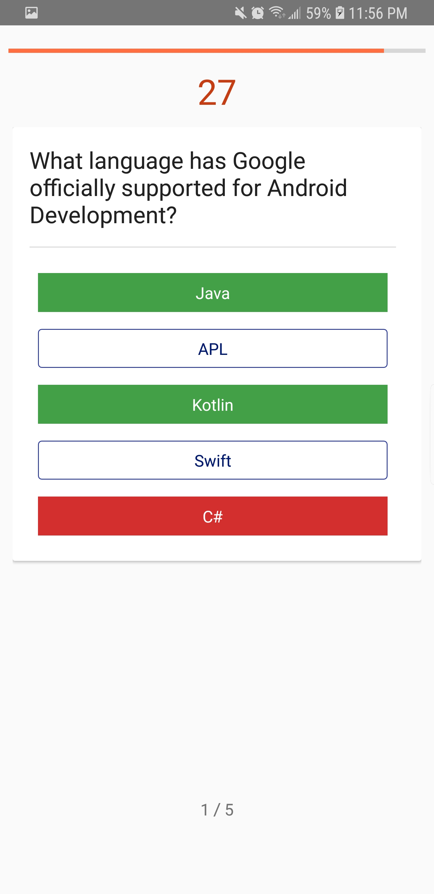

# Quizza - The FBLA Mobile Quiz App

The presentation slides can be viewed [here](presentation-converted.pptx).

## Topic Correlation

Quizza comes with 5 local sample quizzes. Users can create new quizzes and publish them online through the app. Offline quizzes can also be created without publishing online. These quizzes allow for FBLA members to spread and gain knowledge about FBLA competitive events, parliamentary procedure, and other FBLA details. Quizzes can be played online with friends or strangers to create a competitive atmosphere. The goal of this app is to make it fun and easy for students and FBLA members to learn on the go.

## Features

*   Creatable user accounts
*   Online and offline quiz creation and battles
*   Play online in realtime matches against friends
*   Editable quizzes with an in-app quiz editor
*   Instant feedback on correct and incorrect answers
*   An overview screen after finishing a quiz, displaying all questions and answers
*   Easy bug reports in case the user notices a bug with the application

### Run Instructions

1.  Copy the application binary (Quizza.apk) to an Android device running Android 5.1 or up
2.  Install the APK file on the device
3.  Open Quizza from the application launcher
4.  Register an online account or login offline
5.  Explore the application

### Development Instructions

1.  Install [Android Studio](https://developer.android.com/studio/)    
2.  Install [Apache Maven](https://maven.apache.org/install.html)
3.  Run `mvn install` within `source/quiz-game-server/quiz-game-client`
4.  Open Quiz.iml in the `source/quizza-android` folder
5.  Explore the application

#### Usage

Quizza can be installed on an Android Device (Android 5.1 and up) by using the provided .apk file.

#### Generating Application Binaries (.apk)

    ./gradlew :base:bundleRelease

Applications can also be generated using Android Studio by opening the project file (`Quiz.iml` or `build.gradle`)

### Technologies Used

*   [Android Studio](https://developer.android.com/studio/) - used to create professional Android applications
*   [Adobe Illustrator](https://www.adobe.com/products/illustrator.html) - used to create icons and images
*   [Gradle](https://maven.apache.org/) - used to automate builds and manage dependencies in an efficient manner
*   [Git SCM](https://git-scm.com/) - used for version control
*   [Apache Maven](https://maven.apache.org/) - used to manage dependencies for the Quiz-Game-Server
*   [Kotlin](http://kotlinlang.org/) - used to structure and architect apps to avoid common code errors

### Dependencies (Android App)

*   [AndroidX Support Library](https://developer.android.com/jetpack/androidx/) (includes androidx.appcompat:appcompat, androidx.constraintlayout:constraintlayout, androidx.cardview:cardview, androidx.lifecycle:lifecycle-extensions) - used to create Android applications with support for multiple APK versions
*   [Google Design Support Library](https://www.adobe.com/products/illustrator.html) (includes com.google.android.material:material) - used to create Android applications with a consistent look and feel
*   [Retrofit](https://square.github.io/retrofit/) includes (com.squareup.retrofit2:retrofit, com.squareup.retrofit2:converter-gson) - used for interfacing with a web service
*   [Picasso](http://square.github.io/picasso/) includes (com.squareup.picasso:picasso) - used for loading images from a web service
*   [Google Play Services Authentication](https://developers.google.com/identity/) includes (com.google.android.gms:play-services-auth) - used for authenticating users using Google Services
*   [Android Confetti](https://github.com/jinatonic/confetti) includes (com.github.jinatonic.confetti:confetti) - used for adding interactivity and engaging the user visually with particle effects
*   [Kotlin](http://kotlinlang.org/) - used for null-safety and new language features
*   [RxJava2 and RxAndroid](https://github.com/ReactiveX/RxJava) - used for event-based programming
*   [Roxie](https://github.com/ww-tech/roxie) - used as a helper for a MVI-based (model-view-intent) architecture

### Screenshots

All screenshots can be found in PDF form at [the root of the submission.](screenshots-pages-deleted.pdf)

#### Practicing a Quiz:

  
  

 
  

#### Finding an online match:

  

#### Quiz Stats Overview:

  

#### Quiz Details:

  

##### Editing a Quiz:

  

##### Quiz Login & Registration:

##### Quiz User Profile:

  

##### Quiz App Icon:

